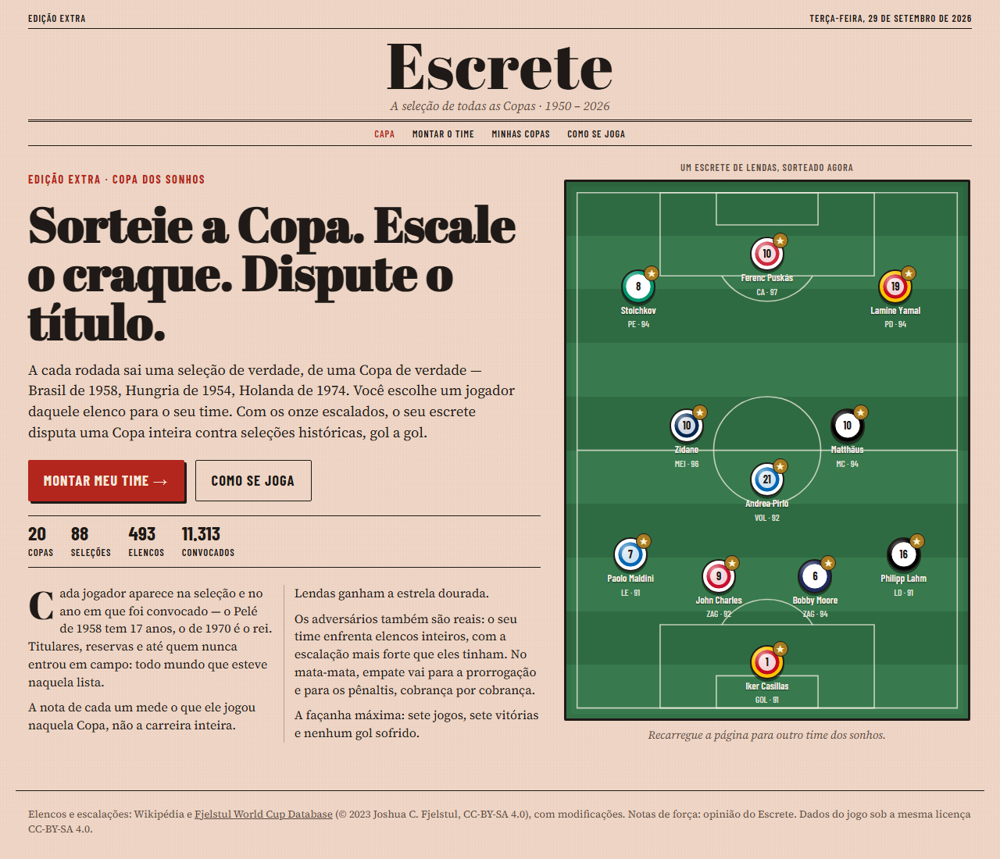
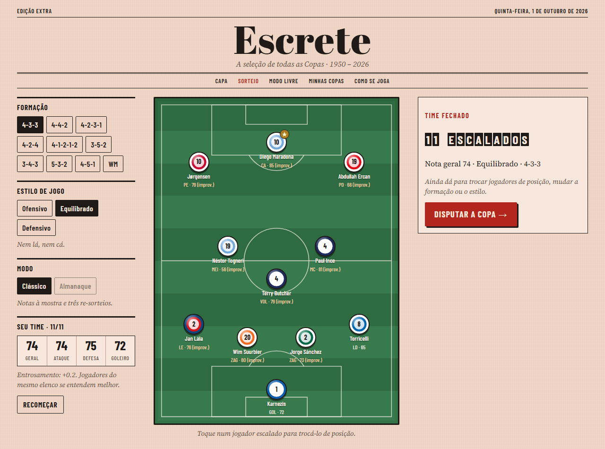
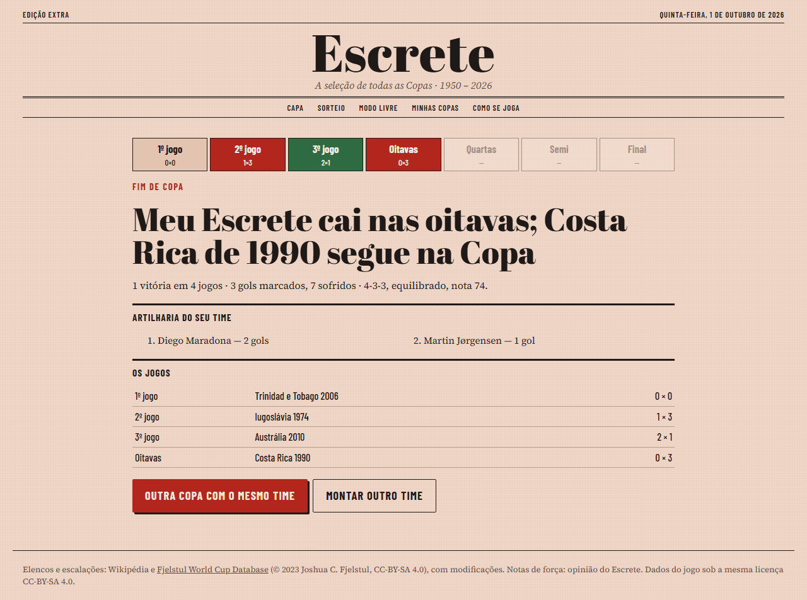
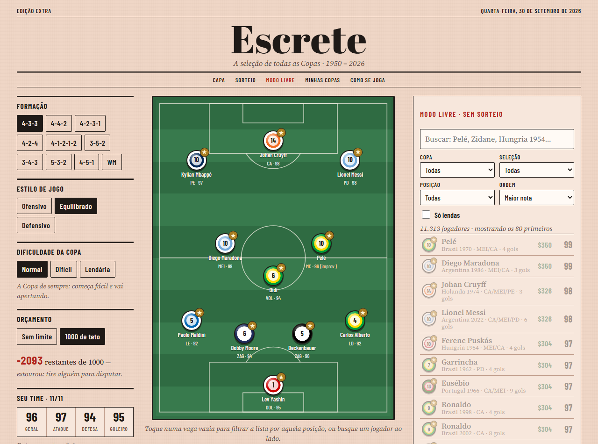

# Escrete — a seleção de todas as Copas

**Jogue: https://raflael.github.io/escrete/**



A cada rodada sai uma seleção de verdade, de uma Copa de verdade — Brasil de 1958, Hungria de 1954,
Holanda de 1974. Você escolhe um jogador daquele elenco para o seu time. Com os onze escalados, o seu
escrete disputa uma Copa inteira contra seleções históricas, gol a gol.

A façanha máxima: sete jogos, sete vitórias e nenhum gol sofrido.

## Como se joga

- **Sorteio** — sai uma seleção e uma Copa; você leva um jogador para uma vaga livre. Três re-sorteios:
  "outra seleção" mantém a Copa, "outra Copa" mantém o país.
- **Posições** — cada jogador tem as posições em que jogou *naquela* Copa. Numa posição vizinha ele
  improvisa e perde alguns pontos. Jogadores do mesmo elenco ganham entrosamento.
- **Almanaque** — as notas ficam escondidas: só nome, posição e memória.
- **Modo livre** — sem sorteio: busque qualquer jogador de qualquer Copa. Com dificuldade normal,
  difícil ou lendária, e um teto de orçamento opcional para um time só de craques não caber.
- **A Copa** — grupo de quatro, oitavas, quartas, semi e final contra elencos reais, cada vez mais
  fortes. No mata-mata, prorrogação e pênaltis cobrança por cobrança.

| Montagem | A Copa | Modo livre |
|---|---|---|
|  |  |  |

## Os dados

**20 Copas (1950–2026), 493 elencos, 11.313 convocados.** Tudo é refeito pelos scripts de
`ferramentas/`, a partir de fontes abertas:

1. `extrair-elencos.mjs` — convocados de cada Copa (páginas "FIFA World Cup squads" da Wikipédia).
2. `extrair-partidas.mjs` — escalações jogo a jogo das páginas de grupos e mata-mata: posição exata
   naquela partida, titular ou reserva, minutos e gols.
3. `consolidar.mjs` — junta tudo por jogador e Copa, com a campanha de cada seleção.
4. `nota-base.mjs` + `dados/notas/<ano>.txt` — a nota de cada jogador. Uma nota-base calculada pelos
   fatos (campanha, minutos, carreira pela seleção, gols) e, por cima, mais de 3.400 avaliações
   individuais escritas à mão, uma linha por jogador (`Pelé = 99 L | MEI CA`). As notas são opinião —
   discorde à vontade editando os arquivos de texto.
5. `exportar.mjs` — gera `dados/jogo/elencos.json`, o arquivo que o jogo lê.

## Rodar localmente

Não há build nem dependências: é HTML, CSS e JavaScript puro.

```
node serve.cjs          # http://localhost:8110
node testes/balanceamento.mjs   # simula milhares de Copas para calibrar a dificuldade
node testes/fluxo.mjs           # joga uma partida inteira num Chrome sem janela
```

## Créditos e licenças

- **Código:** MIT (veja `LICENSE`).
- **Dados** (`dados/`): CC-BY-SA 4.0, derivados da [Wikipédia](https://en.wikipedia.org) e da
  [Fjelstul World Cup Database](https://github.com/jfjelstul/worldcup) (© 2023 Joshua C. Fjelstul, Ph.D.,
  CC-BY-SA 4.0), com modificações. As notas de força são opinião do Escrete.
- **Fontes:** Abril Fatface, Barlow Condensed e Source Serif 4 (SIL Open Font License).
- Projeto independente de fã, sem vínculo com a FIFA ou com federações. Inspirado nos jogos de
  "monte a seleção dos sonhos".
